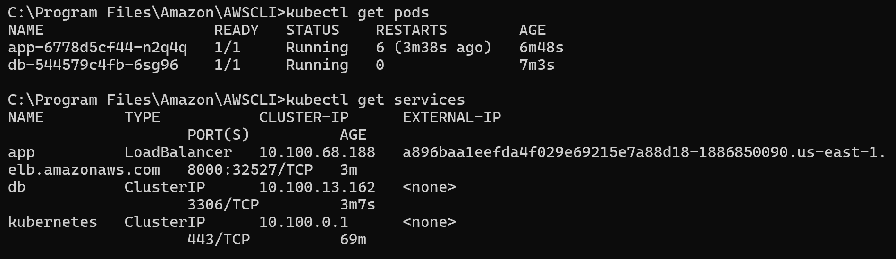
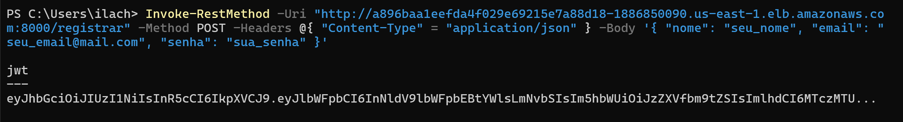
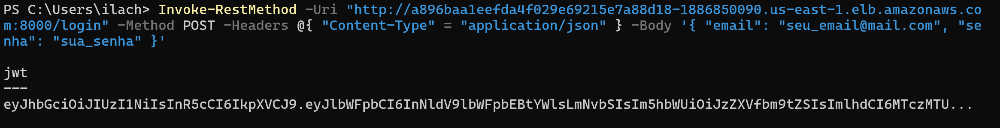
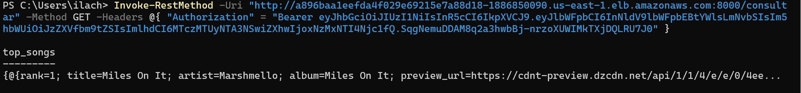

# Guia de Configuração e Implantação no Amazon EKS

Este guia detalha o processo de configuração de um ambiente Kubernetes no Amazon EKS, desde a criação da conta até a implantação da aplicação.

## 1. Configuração Inicial na AWS

Para iniciar, configurei a minha conta AWS com permissões administrativas, para garantir controle total sobre os recursos da AWS e a possibilidade de configurar credenciais adicionais para uso programático.

## 2. Configuração de Credenciais do AWS CLI

Para interagir com os serviços AWS diretamente do terminal, foi necessária a configuração do AWS Command Line Interface (CLI). O primeiro passo foi gerar uma **Access Key** no IAM, que nos da uma **Secret Key**.

Essas credenciais são utilizadas pelo CLI para autenticação e execução de comandos de forma segura.

## 3. Instalação do AWS CLI

O AWS CLI foi instalado seguindo a [documentação oficial](https://docs.aws.amazon.com/cli/v1/userguide/cli-chap-welcome.html). A seguir está um resumo dos passos seguidos:

1. **Download do instalador**: [AWSCLI64PY3.msi](https://s3.amazonaws.com/aws-cli/AWSCLI64PY3.msi).

2. **Execução do instalador MSI**, a partir da execução do arquivo baixado e wizard de instalação.

3. **Verificação da instalação** com o comando: ```aws --version```

4. **Configuração do ambiente** com ```aws configure```:
    - Adição do Access Key e da Secret Access Key.
    - Definição da região padrão (us-east-1).
    - Definição do formato de saída padrão como  JSON.

5. **Instalação e Configuração do eksctl**

    Para gerenciar ```clusters Kubernetes``` de forma simplificada no Amazon EKS, utilizamos o ```eksctl```. Ele automatiza a criação e configuração dos clusters, reduzindo a complexidade operacional.

    Comando executado:

    ```bash
    eksctl create cluster --name cluster-projnuvem --nodes 2
    ```

    **Nome do cluster:** cluster-projnuvem.
    **Nós:** 2, conforme especificado na documentação do projeto.

    Esse comando criou um cluster funcional com dois nós prontos para execução de workloads.

6. **Atualização do kubeconfig**

    Após a criação do cluster, foi necessário configurar o arquivo ```kubeconfig``` local. Esse arquivo permite o gerenciamento do cluster através do kubectl, a principal ferramenta de interação com Kubernetes.

    Comando utilizado:

    ```bash
    aws eks update-kubeconfig --name cluster-projnuvem
    ```

    Esse passo garantiu a conexão entre o ambiente local e o cluster no EKS, habilitando a execução de comandos Kubernetes diretamente.

7. **Criação dos Arquivos YAML para Deployments**

    Para implantar os serviços no Kubernetes, foram criados dois arquivos YAML baseados no ```compose.yaml``` original do projeto:

    ```db-deployment.yaml```: Define a configuração do banco de dados MySQL.
    ```app-deployment.yaml```: Especifica a aplicação FastAPI.

    **Função dos Deployments:**

        - Banco de Dados:
            - Garante a persistência e escalabilidade do MySQL.
            - Configura um serviço interno para comunicação com a aplicação.

        - Aplicação:
            - Implanta a API da aplicação.
            - Expõe a aplicação ao público utilizando um LoadBalancer.

8. **Aplicação dos Deployments no Cluster**

    Com os arquivos YAML configurados, os deployments foram aplicados ao cluster com os seguintes comandos:

    ```bash
    kubectl apply -f db-deployment.yaml
    kubectl apply -f app-deployment.yaml
    ```

    Para verificar o status dos pods e serviços, foram utilizados:

    ```bash
    kubectl get pods
    kubectl get services
    ```

    Esses comandos garantem que os serviços estejam em execução e acessíveis, como pode-se observar na seguinte imagem:

    

9. **Acesso à Aplicação**

    O serviço da aplicação foi configurado com um ```LoadBalancer```. Para acessar a aplicação:

    - Obtenha o endereço externo:
    ```bash
    kubectl get service app
    ```

    - Validar a aplicação via testes da API no terminal, assim como anteriormente. Lembre-se de trocar o IP `localhost` para o IP externo do serviço app:
    http://EXTERNAL-IP:8000

    ### Validação

    #### Registro de usuário:
    

    #### Login de usuário:
    

    #### Consulta da API:
    

    ### Video de teste

    [https://drive.google.com/file/d/18933qpHzV_urL01rw8eejWsuAWL2aPGQ/view?usp=drive_link](https://drive.google.com/file/d/18933qpHzV_urL01rw8eejWsuAWL2aPGQ/view?usp=drive_link)
