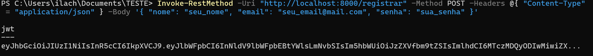
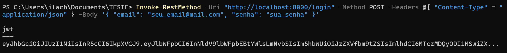
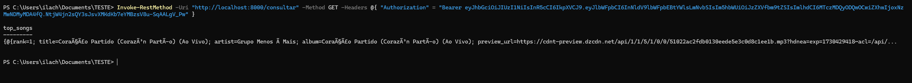

# Testando a API

Para demonstrar o funcionamento de cada endpoint, aqui estão alguns exemplos usando os comandos fornecidos em [Usando a API](./index.md#usando-a-api).

## **POST /registrar**:

## **POST /login**: 

## **GET /consultar**: 

## Video da execução:

https://drive.google.com/file/d/11KQkN-TeJSlnvjZ5QXC9eBWPTq7pGhsm/preview

